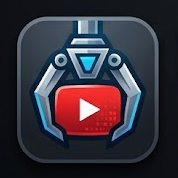

<p align="center">
  
</p>

<h1 align="center">YTSzarpak</h1>

<p align="center">
  Eine kleine plattformübergreifende Desktop-App zum Herunterladen von Medien mit <a href="https://github.com/yt-dlp/yt-dlp">yt-dlp</a> — ohne ständig im Terminal arbeiten zu müssen.
</p>

<p align="center">
  <a href="README.md">English</a> · <a href="README.pl.md">Polski</a> · <strong>Deutsch</strong>
</p>

---

YTSzarpak ist für die Momente gedacht, in denen yt-dlp genau das richtige Werkzeug ist, man aber nicht schon wieder dieselben Befehle eintippen möchte.

Link einfügen, Format auswählen, zur Warteschlange hinzufügen — den Rest der Kommandozeilenarbeit übernimmt die App. Neben YouTube funktionieren auch die vielen anderen Webseiten, die von yt-dlp unterstützt werden.

## Was YTSzarpak kann

- **Video- und Audio-Downloads** über yt-dlp.
- **Qualitätsauswahl** anhand der Formate, die für den jeweiligen Link tatsächlich verfügbar sind.
- **Nur-Audio-Modus** mit MP3 und weiteren gängigen Ausgabeformaten.
- **Download-Warteschlange** mit Fortschritt, Geschwindigkeit, Restzeit und Aktionen pro Eintrag.
- **Playlist-Unterstützung**, wenn eine Playlist-URL eingefügt wird.
- **YouTube-Anmeldung** über Browser-Cookies oder eine exportierte `cookies.txt`-Datei.
- **Automatische Einrichtung von yt-dlp und Update-Prüfung.**
- **Automatische FFmpeg-Einrichtung**, wenn keine brauchbare Systeminstallation gefunden wird.
- **Windows, macOS und Linux** aus einer gemeinsamen Avalonia/.NET-Codebasis.

## So funktioniert es

1. Eine unterstützte Medien-URL einfügen.
2. Auf **Grab** klicken, damit YTSzarpak die verfügbaren Formate ermittelt.
3. Videoqualität auswählen oder in den Nur-Audio-Modus wechseln.
4. Den Eintrag zur Warteschlange hinzufügen.
5. Während die Downloads im Hintergrund laufen, können weitere Links ergänzt werden.

Die App versucht nicht, einen eigenen Downloader neu zu erfinden. Sie ist eine Desktop-Oberfläche für yt-dlp und FFmpeg; beide Werkzeuge bleiben dabei getrennte und austauschbare Komponenten.

## YouTube-Anmeldung

Einige YouTube-Videos sind nur für angemeldete Nutzer verfügbar.

YTSzarpak fragt niemals nach deinem Google-Passwort. Stattdessen kann die App Cookies aus einem Browserprofil verwenden, in dem du bereits angemeldet bist. Falls das Auslesen aus dem Browser scheitert — besonders Chrome unter Windows kann seine Cookie-Datenbank sperren — exportiere eine `cookies.txt`-Datei im Netscape-Format und wähle sie unter **Settings** aus. Wenn beide Methoden konfiguriert sind, hat die Cookie-Datei Vorrang.

## FFmpeg

FFmpeg wird unter anderem benötigt, um getrennte Video- und Audiostreams zusammenzuführen oder Audio zu konvertieren.

Wenn YTSzarpak FFmpeg nicht auf dem System findet, lädt die App automatisch einen kompatiblen Build in ihr eigenes Anwendungsdaten-Verzeichnis. Unter **Settings** kann weiterhin eine bestimmte FFmpeg-Installation manuell ausgewählt werden.

## Aus dem Quellcode bauen

Benötigt wird das **.NET 10 SDK**.

```bash
git clone https://github.com/quendae/ytSzarpak.git
cd ytSzarpak
dotnet build
```

Desktop-App direkt starten:

```bash
dotnet run --project src/YtDlpGui.App
```

## Distributierbare Builds erstellen

Das Repository enthält plattformspezifische Publish-Skripte. Sie erzeugen selbstständige Builds, sodass Endnutzer weder .NET noch Python separat installieren müssen.

| Plattform | Befehl | Ausgabe |
| --- | --- | --- |
| Windows | `publish\publish-windows.ps1` | `publish\output\win-x64\YTSzarpak.exe` |
| macOS | `./publish/publish-macos.sh` | `publish/output/osx-{x64,arm64}/YTSzarpak.app` |
| Linux | `./publish/publish-linux.sh` | `publish/output/linux-x64/YTSzarpak` |

## Ein paar technische Details

YTSzarpak basiert auf **Avalonia 12** und **.NET 10**. Der UI-Zustand wird mit `CommunityToolkit.Mvvm` verwaltet; Download-Logik und Binärverwaltung liegen im separaten Projekt `YtDlpGui.Core`.

Beim ersten Einsatz wird yt-dlp als eigenständige Binärdatei heruntergeladen und im Anwendungsdaten-Verzeichnis gespeichert. YTSzarpak kann nach neueren yt-dlp-Versionen suchen und die verwaltete Kopie aktualisieren, ohne dass Python oder pip installiert werden müssen.

## Projekte von Drittanbietern

YTSzarpak baut auf einigen hervorragenden Open-Source-Projekten auf:

- [yt-dlp](https://github.com/yt-dlp/yt-dlp) — Medienextraktion und Downloads.
- [FFmpeg](https://ffmpeg.org/) — Verarbeitung, Zusammenführung und Konvertierung von Medien.
- [Avalonia UI](https://avaloniaui.net/) — plattformübergreifende Desktop-Oberfläche.

Jedes Drittanbieterprojekt behält seine eigene Lizenz und seine eigenen Distributionsbedingungen. Dieses Repository enthält derzeit keine separate Lizenzdatei für YTSzarpak selbst.

---

<p align="center">
  Eine einfache Desktop-Oberfläche für ein ausgesprochen leistungsfähiges Kommandozeilenwerkzeug.
</p>
